# 关于 Github Action 的一份不完全指南

也可以从[我的代码仓库进入(外部链接)](https://github.com/Wu-Yijun/github-actions-tutorial)

## 镇楼


## 目录

- 
- [介绍](#github-action-能干什么)
- [创建 Action](#github-action-怎么用)
- [基本用法](#yaml-文件怎么写)
  - [YAML 文件格式](#yaml-文件结构格式)
  - [触发器](#触发器)
  - [工作流](#工作流)
  - [最基本的示例](#一个基本的简单的例子)
- 进阶 - 文件和参数的传递
  - [设置和使用环境变量, 在步骤间传递参数, 在工作间传递参数](#环境参数的定义,-使用,-与传递)
  - [在工作间传递文件](#上传和下载附件)
- 进阶 - 运行其它格式的脚本
  - [Javascript 脚本](#运行-javascript-脚本)
    - [简易/基本用法](#javascript-脚本-启动)
    - [高级用法](#更好的执行-js-脚本)
      - [输入输出](#输入输出)
      - [执行外部 js](#从文件运行-js)
      - [调用Github REST API](#js-中使用-rest-api)
  - [Python 脚本](#运行-python-脚本)
- 进阶 - 外部 Action 的使用
  - [上传和下载文件到/从Artifact区](#上传和下载附件): actions/upload-artifact\@main [(外部链接)](https://github.com/actions/upload-artifact) actions/download-artifact\@main [(外部链接)](https://github.com/actions/download-artifact) \@actions/artifact [*(npm 库)*(外部链接)](https://github.com/actions/toolkit/tree/main/packages/artifact) 
  - [使用仓库的文件和代码](#使用仓库的文件和代码): actions/checkout\@main [(外部链接)](https://github.com/actions/checkout)
  - 创建和发布 release: actions/create-release\@main [(外部链接)](https://github.com/actions/create-release), actions/upload-release-asset\@main [(外部链接)](https://github.com/actions/upload-release-asset)
  - [使用 JavaScript 脚本](#更好的执行-js-脚本): actions/github-script\@main [(外部链接)](https://github.com/actions/github-script)
- 进阶 - [Github REST API](#github-rest-api-教程)
- 高级 - 更多技巧
  - Matrix 矩阵, 复用代码
- 高级 - 奇技淫巧
- 高级 - 实例分析
  - rust 项目的构建测试 和 Release 的发布更新
- 高级 - 写自己的库, 用的人多了, 就可以删库跑路了
  - 将示例集成为库, 一键调用


有些内容我还没写完, 也有些部分写的不全面, 还有些内容我没涉及到, 如果你有相关经验/经历, 不妨写一点自己的东西回复到后面, 我看见了也会给它放到目录里. 这样也显得我抛出去的砖没有沉入海底, 而能泛起一些波澜, 甚至引出几块美玉.

---

## Github Action 能干什么
 
*ChatGPT 是这样说的.*

GitHub Actions 是一个功能强大的自动化工具，可以帮助开发人员自动化软件开发工作流程中的各种任务。它可以执行各种操作，包括但不限于：

1. **持续集成**: 在每次代码提交或 Pull Request 提交时自动运行测试，确保代码质量。
2. **持续部署 (CD)**: 将代码部署到测试环境或生产环境，以自动化发布过程。
3. **自动化代码质量检查**: 运行静态代码分析工具、代码风格检查工具和安全漏洞扫描工具，以确保代码质量和安全性。
4. **自动化文档生成**: 从代码中生成文档，并将其发布到指定位置，如 GitHub Pages。
5. **通知和警报**: 通过邮件、Slack 或其他渠道发送通知和警报，以便及时响应事件。
6. **版本控制和自动发布**: 根据版本标签或其他条件自动发布软件包、库或应用程序。

自定义任务和工作流程：根据项目需求，执行各种自定义任务和工作流程，以满足特定的开发和部署需求。
总的来说，GitHub Actions 可以帮助简化开发流程，提高开发团队的效率，减少手动操作，降低出错的可能性，并加速软件的交付速度。

*依我看*, Github Action 就是 Github 提供的一个**云服务器,** 可以访问你的库, 下载依赖或其它程序, 运行脚本或程序, 最后还可以利用 GitHub REST API 进行各种库的操作.

也就是说, 你可以白嫖 GitHub 的计算资源, 在云端进行一些计算.

由于 GitHub Action 的教程不多, 也没什么人会用, 很多人只会点出一个推荐配置, 然后 "能跑就行, 我也不知道我配了个啥" (反正我一开始就是这样的). 然后当我真正想用的时候, 却发现它的坑很多, 网上的教程也很少, 很多东西只能自己总结, 摸索.
前人(~~我自己~~)踩了那么多坑, 好不容易踏出一条羊肠小路, 总不能看着它就荒废了, 那就为后人做点贡献, 能指一下方向也是好的.

因此, 这篇帖子的后面的部分给出了一个 Github Action 的**从 0 到 1** 的教程, 至于能否二生三, 三生万物, 那就得看各位的造诣了.

## Github Action 怎么用

你将 YAML文件(.yml, .yaml) 扔到 `.github/workflows` 文件夹下, Github 会自动检测到并且添加到 Actions 部分, 左下方 `all workflows` 下方的对应的就是你的各个YAML文件的工作流, 右侧是这些工作流每次运行的结果. **只有主分支创建的yaml文件会被收入工作流, 其它分支可以修改此工作流但是不能创建新的**
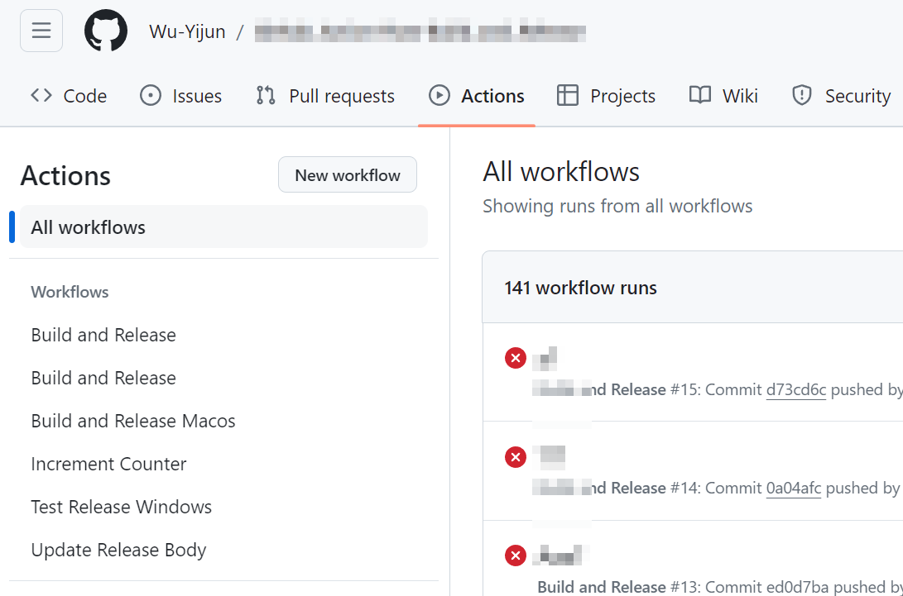

如果你没有 workflow 文件, GitHub 会根据你的项目, 自动推荐一些可能的工作流(如下图所示), 或者你也可以手动设置([set up a workflow yourself](#github-action-怎么用))
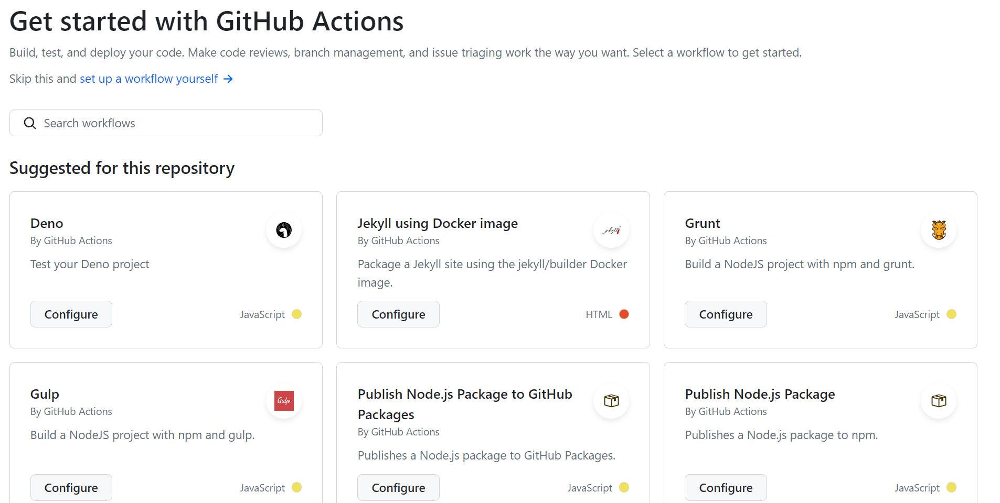

## YAML 文件怎么写

yaml 文件的关键有两个部分触发器和工作流

触发器 [triggers](#触发器) 定义了何时 GitHub 将运行 Action。
工作流 [jobs](#工作流) 定义了运行后执行什么工作.

#### YAML 文件结构格式

参见 [菜鸟教程(外部链接)](https://www.runoob.com/w3cnote/yaml-intro.html)

YAML 的语法和其他高级语言类似，并且可以简单表达清单、散列表，标量等数据形态。它使用空白符号缩进和大量依赖外观的特色，特别适合用来表达或编辑数据结构、各种配置文件、文件大纲.

YAML 对大小写敏感, 使用缩进表示层级关系, 缩进的空格数不重要，只要相同层级的元素左对齐即可, `#` 后表示注释

YAML 支持以下几种**数据类型**：

- 对象：键值对的集合，又称为映射（mapping）/ 哈希（hashes） / 字典（dictionary）
- 数组：一组按次序排列的值，又称为序列（sequence） / 列表（list）
- 纯量（scalars）：单个的、不可再分的值

##### 对象

对象键值对使用冒号结构表示 `key: value`，冒号后面要加一个空格。
也可以使用 `key: {key1: value1, key2: value2, ...}`。
还可以使用缩进表示层级关系；
```YAML
key: 
  child-key: value
  child-key2: value2
```

##### 数组

数组使用方括号逗号结构表示 `[value1, value2, [sub val 1, sub val 2], ...]`.
还可以用 - 开头的行表示构成一个数组, 使用缩进表示层级关系；
```YAML
- value1
- value2
- 
  - sub val 1
  - sub val 2
```

##### 纯量

纯量是最基本的，不可再分的值，包括：
字符串, 布尔值, 整数, 浮点数, Null, 时间, 日期


#### 触发器

Trigger 可以有不同的方式, 具体包括:

1. **Push 触发器：** 当某人将代码推送到仓库时触发。可以根据分支和路径进行过滤。

```yaml
on:
  push:
    branches:
      - main
      - master
      - some-other-branches
    paths:
      - 'src/**'
      - 'paths/to/your/changed/files'
```

branches 过滤器告诉GitHub当你的哪一个分支提交时触发此工作流, branches 后紧跟着的就是分支的名称列表.

paths 路径过滤功能允许你指定只有在特定路径下的文件发生变化时才触发 GitHub Action。这对于大型仓库中只对特定目录或文件感兴趣的工作流程非常有用。
路径过滤是通过使用 paths 关键字实现的。你可以指定一个文件或一组文件的路径，也可以使用通配符模式匹配多个文件或目录。

这两个过滤器的条件的合取作为push触发器的条件.

*疑问: 我希望在main分支的任何文件发生变化, 或是branchA分支的src/文件夹下文件发生改变时才触发, 该怎么设置触发器?*

2. **Pull Request 触发器：** 当有 Pull Request 被打开、更新或合并时触发。

```yaml
on:
  pull_request:
    types: [opened, synchronize, closed]
```

pull_request 触发器用于在 Pull Request 相关事件发生时触发 GitHub Actions。这些事件包括：

- Pull Request 被打开（opened）
- Pull Request 被更新（synchronize）
- Pull Request 被关闭（closed）

3. **定时触发器：** 按照设定的时间表触发 Action。可以是 cron 表达式。

```yaml
on:
  schedule:
    - cron: '0 0 * * *' # 每天 0 点触发
    - hourly            # 每小时触发一次
```

schedule 表示这是一个定时触发器, 后面跟着时间表项列表. 每个时间表项定义了触发 Action 的时间规则。它可以是 cron 表达式，也可以是简单的字符串。

**Cron 表达式**： Cron 表达式是一种灵活的时间表达方式，允许你按照分钟、小时、天、月、星期等单位来指定触发时间。例如，0 0 * * * 表示每天的零点触发，0 0 * * MON 表示每周一的零点触发。
**简单的字符串**： 除了 cron 表达式外，GitHub Actions 还支持一些预定义的字符串，比如 `every 5 minutes`, `every 30 minutes`, `every hour`, `hourly`, `daily`, `weekly` 等。


4. **仓库调度触发器：** 当 GitHub 启动了仓库的工作流程时触发。

```yaml
on:
  repository_dispatch:
    types: [my_event_type, other-event-types]
```

types 筛选了触发的类型列表, 如果略去则任意名称

要触发这个工作流程，你需要通过 GitHub API 发送一个 POST 请求。请求的内容应包含与 types 字段匹配的事件类型。例如，在命令行中可以使用 curl 发送类型为 my_event_type 的请求：

```Shell
curl \
  -X POST \
  -H "Authorization: token YOUR_GITHUB_TOKEN" \
  -H "Accept: application/vnd.github.everest-preview+json" \
  https://api.github.com/repos/$owner/$repo/dispatches \
  -d "{\"event_type\": \"$my_event_type\"}"
```

5. **外部触发器**: 手动触发 Action.

```yaml
on:
  workflow_dispatch:
    inputs:
      name-of-var:
        description: 'Description of this var'
        required: true
        default: 'default string'
      name-of-var-2:
        description: 'Description of this var2'
        required: false
```

workflow_dispatch 说明这是一个外部触发器, inputs 部分包含了需要输入的参数,description 给出了在网页上显示的变量名称(描述), required 规定了此参数是否是必须的, 而 default 给出了填充此参数的默认字符.

这些设置的字符串都被保存在 `github.event.inputs` 对象中. 通过 `${{ github.event.inputs.name-of-var }}` 在 jobs 中引用.

当设置了 workflow_dispatch , 我们可以在action对应页面的右上方找到 run workflow 的选项, 手动触发此工作流.
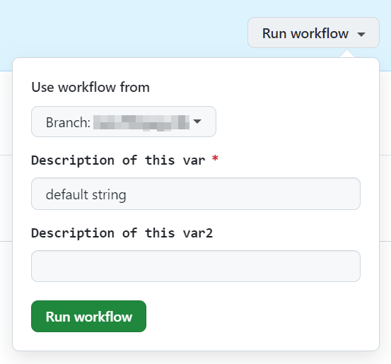

#### 工作流
工作流对应着 jobs 字段, 也是必选的.

jobs 里可以有多个工作, 所有工作可以**并行**进行, 通过指定工作的**依赖关系**, 可以控制这些工作先后顺序, 进而形成工作流.

jobs 下的每一项都对应一个独立的工作, 每一项的 key 值就是这个 job 的 job_id , 而 value 对应着每个工作的具体设置.

每个工作需要设置运行环境, 至少包括 `runs-on` 和 `steps`
runs-on 对应着运行时使用的操作系统, 可以为 `ubuntu-latest`, `macos-latest`, `windows-latest` 等.
steps 为一个数组, 每一项对应一个步骤, 按顺序依次执行. 如果在中间出现错误, 则终止后面的全部工作.
步骤的名称使用 name 字段控制, 而步骤的具体内容可以为控制台脚本, 也可以使用外部Action.
控制台命令通过 run 字段输入, 而外部 Action 通过 uses 字段决定使用的库, 通过 with 字段输入参数.

#### 一个基本的简单的例子

*.github/workflows/example.yaml*
```YAML
name: Example Workflow # 工作流名称

on: # 定义触发条件
  push: # 当push到main分支时触发
    branches:
      - main
  workflow_dispatch: # 或 手动触发
    inputs: # 定义输入参数列表
      name-of-var: # 第一个待输入参数
        description: 'Description of this var'
        required: true
        default: 'default string'
      name-of-var-2: # 第二个待输入参数
        description: 'Description of this var2'
        required: false # 可选参数, 可以不输入

jobs: # 定义工作流
  echo-hello: # 工作流名称
    runs-on: ubuntu-latest # 运行环境
    steps: # 步骤
      - name: Echo hello # 步骤 1 的步骤名称
        # 使用 run 关键字执行 shell 命令
        run: echo "Hello, ${{ github.event.inputs.name-of-var }}"
      - name: Echo hello 2 # 步骤 2 的步骤名称
        # run 关键字后加 | 表示多行命令
        run: |
          HELLO2="Hello, ${{ github.event.inputs.name-of-var-2 }}"
          echo $HELLO2
          echo $HELLO2 > hello2.txt
      - name: upload-artifact # 步骤 3 的步骤名称
        # 使用 uses 关键字引用 actions/upload-artifact\@v2 动作
        # 这个动作会将 hello2.txt 上传到 GitHub Actions 的 Artifacts
        uses: actions/upload-artifact\@v2
        with: # 输入参数列表
          name: hello2
          path: hello2.txt

```

你可以在 Action 下看到多出了一个名为 Example Workflow 的工作流, 点进去你发现有一个运行成功的(或者正在运行中) 的工作, 点进去.

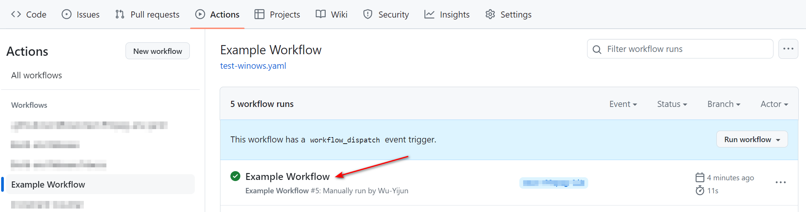

然后就来到了这个summary界面, 它有一个流程图, 由于我们只有一个工作, 因此流程图只有一个块, 名称就是我们设置的 echo-hello. 页面最下方还有一个 Artifacts 模块, 里面有我们在最后一步上传的 hello2.txt 文件, 它被打包压缩为了 hello2.zip, 点击可以下载.


文件如下(由于我是手动触发的, 因此填充的文本不是空的, 如果是pull触发的, name-of-var-2 字段则为空, 打印出来只有 `Hello, `)

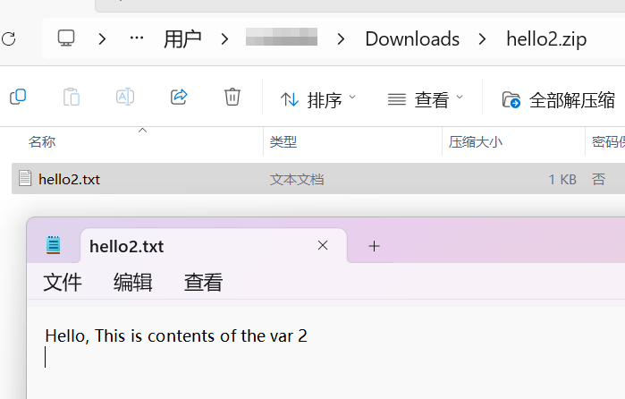

我们可以点击流程图中的 echo-hello, 或者左侧 Jobs 下的echo-hello, 来看一看这个流程具体干了哪些事情.

- Set up job 根据我们的设置, 配置系统环境, 环境变量(比如 GitHub Token) 等,
- 然后就是我们的第一个步骤, 它打印出来了第一个变量. 注意到我们执行的命令已在执行前经将 action 的变量替换为了字符串, 变成 echo "Hello, default string"
- 第二个步骤是脚本块, 它三行按顺序逐次执行, 然后创建了一个 hello2.txt (在项目的根目录下). 虚拟机里的文件是从项目中下载下来的, 不会影响项目本身的文件, 因此你在项目中也找不到hello.txt. 
- 第三步我们使用外部库 `actions/upload-artifact\@v2` 将这个文件 hello2.txt 上传到**此workflow的附件区**, 可供下载.
- 最后就是结束和清理了.

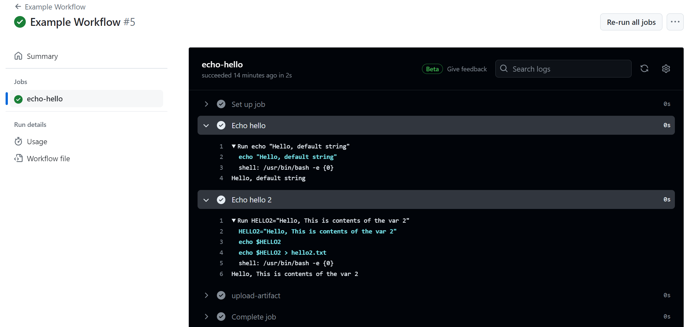

## 环境参数的定义, 使用, 与传递

环境变量可以有多种定义方法. 包含全局的环境变量, 工作环境下的环境变量, 单步的环境变量, GitHub环境变量, 上一步的输出结果, 别的工作的输出结果.

全局的环境变量`HELLO1`在最外层设置, 任何工作的任何步骤中都可用.

第一项工作定义了自己的环境变量 `HELLO2`, 在第一项工作的任何位置可用. 在第一步中还设置了环境变量 `HELLO3` , 第二步打印这些环境变量, 运行的同时设置了单步的环境变量 `HELLO4` . 第三步先标记了 id , 然后又设置了的单步的输出, 这样就可以在第五步中调用这个输出. 第四步是展示了GitHub环境变量包含哪些内容, 于是就可以使用类似第五步的方法打印出来.
第五步打印了两个 github 环境变量, 接着打印了两个输出, 最后打印了最常用的参数, GITHUB_TOKEN. 这些 Acction 变量可用通过 `${{ NAME}` 的方式调取, **在运行时会自动替换为对应的字符, 因此要注意引号和转义字符的问题**
第一个工作同时还有一个 output 字段, 定义了自己的最终输出, 可用从自己的步骤的结果, 从环境变量中获取字符串, 拼接到一起.

第二项工作声明自己依赖于第一项工作, 因此会在第一项工作结束后才开始, 我们可用通过 `${{ needs.env-var-example.outputs.NAME }}` 调用第一项工作的output.

示例代码如下:

*.github/workflows/example-env.yaml*
```YAML
name: Example Workflow Env

on: # 定义触发条件
  workflow_dispatch: # 或手动触发
    inputs: # 定义输入参数列表
      name-of-var: # 第一个待输入参数
        description: 'Description of this var'
        default: 'default string'
      name-of-var-2: # 第二个待输入参数
        description: 'Description of this var2'
        default: "This is contents of the var 2"

env: # 定义全局环境变量
  HELLO1: world1

jobs:
  # 第一项工作
  env-var-example:
    runs-on: ubuntu-latest
    # 设置局域环境变量
    env: # 定义环境变量
      HELLO2: world2
    # 设置输出
    outputs:
      # set-output 步骤的 HELLO5 输出
      HELLO7: ${{ steps.set-output.outputs.HELLO5 }}
      # set-output 步骤的 HELLO6 输出
      HELLO8: ${{ steps.set-output.outputs.HELLO6 }}
      # 环境变量 HELLO1 与 world9 拼接而成
      HELLO9: "hello $HELLO1"
      # set-output 步骤的 HELLO5 输出 与 world10 拼接而成
      HELLO10: ${{ steps.set-output.outputs.HELLO5 }}
    steps:
      # 设置环境变量
      - name: Set env var
        run: |
          echo "HELLO3=world3" >> $GITHUB_ENV
      # 使用环境变量
      - name: Echo env var
        run: |
          echo $HELLO1
          echo $HELLO2
          echo $HELLO3
          echo $HELLO4
        # 设置单步环境变量
        env:
          HELLO4: world4
      # 设置单步输出
      - name: set-output
        # 使用 id 标记名称便于后面的步骤使用这一步的输出
        id: set-output
        run: |
          HELLO5=world5
          echo "::set-output name=HELLO5::$HELLO5"
          echo "HELLO6=world6" >> $GITHUB_OUTPUT
      # 使用单步输出
      - name: use-output
        run: |
          echo ${{ steps.set-output.outputs.HELLO5 }}
          echo ${{ steps.set-output.outputs.HELLO6 }}
      # 打印 Github 环境变量
      - name: Echo github context
        run: node -e "console.log(JSON.stringify(process.env, null, 2))"
      # 使用 Github 环境变量
      - name: use-git-context
        run: |
          echo "${{ github.repository_owner }}'s repo"
          echo ${{ github.event_name }}
          echo ${{ github.event.inputs.name-of-var }}
          echo ${{ github.event.inputs.name-of-var-2 }}
          echo "token = ${{ secrets.GITHUB_TOKEN }}"
  
  # 第二项工作, 依赖第一项工作
  use-output:
    # 依赖项
    needs: env-var-example
    runs-on: macos-latest
    steps:
      # 打印之前步骤的输出
      - name: Echo output
        run: |
          echo ${{ needs.env-var-example.outputs.HELLO7 }}
          echo ${{ needs.env-var-example.outputs.HELLO8 }}
          echo ${{ needs.env-var-example.outputs.HELLO9 }}
          echo ${{ needs.env-var-example.outputs.HELLO10 }}
```

**观察一下第一个的输出结果:**

可用看到运行时将全局变量/工作环境变量/上一步设置的环境变量/单步环境变量全都被打包作为执行此脚本的的环境变量
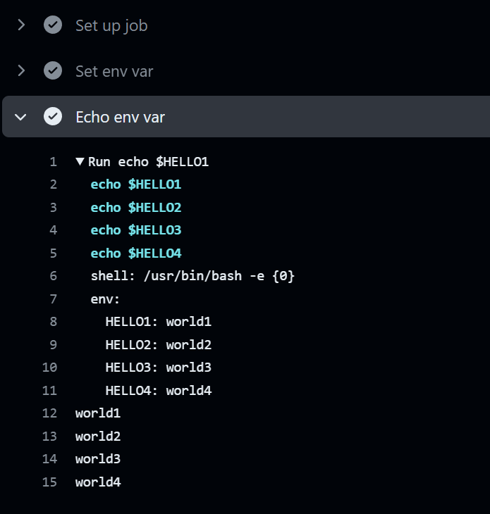

而使用 `${{NAME}}` 获取的环境变量被直接替换为对应的字符, 然后才运行的命令
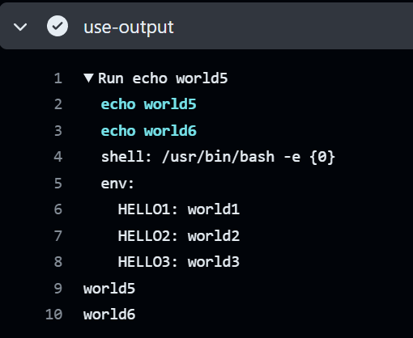

设置单步输出有两种方式, 前者是已弃用的方法, 你会发现它弹出了警告, 后面的方法是推荐的方法, 它们都会将变量的值保持入此步骤的输出中, 后续步骤可通过 `${{ steps.{step_id}.outputs.{name} }}` 获取这些输出.
```Shell
echo "::set-output name={name}::{value}"
echo "{name}={value}" >> $GITHUB_OUTPUT
```


可用用 `${{ github.* }}` 获取到的GitHub环境变量很多, 如下所示
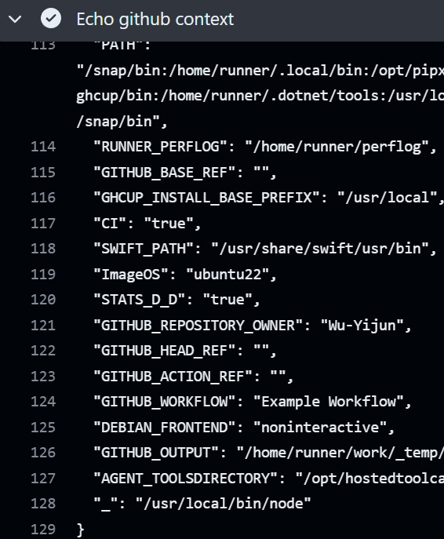

获取GitHub环境变量, 打印token, 可用注意到打印出来的 token 被 * 遮盖了, 这是出于安全性考虑
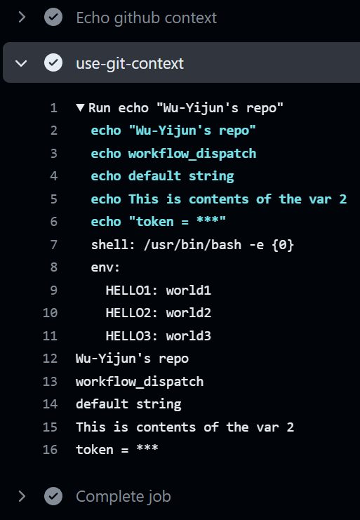

**再看第二个的输出结果**

第二个工作是在 macos 上运行的, 但这不影响它调用全局的环境变量, 以及第一个工作的输出结果.
注意到, 第三个命令中的 $HELLO1 没有被替换, 这说明在第一个工作设置 `OUTPUT3 = "hello $HELLO1"` 时 $HELLO1 没有被代入, 而是作为字符串保留了.
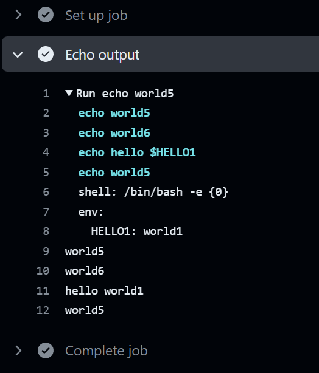

最后在看一下 Summary, 这两个有依赖关系的工作被分成了两个块,并连到了一起.
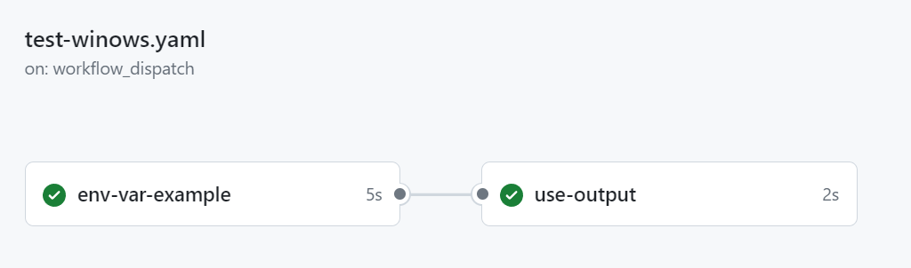

*疑问: 环境变量的范围和生命周期是什么样的, 同名环境变量是采取替换还是遮蔽的策略呢?*

## 使用仓库的文件和代码

如果你在网上找任何一个写好的 Action 文件, 它的第一步多半都是 check out , 而且 98% 的人都不会在这里加任何注释. 你看了半天也没想明白这是干什么的, 但是你知道了, 每一个 Action 都要在第一步干这个, 就像 C 的main函数要 `return 0;` 一样, 反正不要钱, 多少写一点.

```YAML
    steps:
      - name: Checkout code
        uses: actions/checkout\@v4
      # ...
```

但如果你细心的话, 你又会注意到, 我前面的几个示例都没有用这个 checkout, 但是代码却可以正常运行, 说明这似乎不是必须品.

事实上, 这是一个非常有用的步骤, 它的储存库的解释为

> This action checks-out your repository under $GITHUB_WORKSPACE, so your workflow can access it.

也就是说, 它把你的最新的代码下载到了根目录下, 这样你可用直接访问你的库里的文件.
如果不设置这一步, 也可能没什么影响, 只要你不需要访问你仓库里的代码, 你完全可以不加!

然而, 这一步虽然重要, 但它不是必要的, 而且又太寻常了, 懂的人不用解释, 不懂的人也不需要解释, 放他过去也无大碍. 
*谁会给 main 函数的最后一个 `return 0;` 加一行注释呢?*

这个库有 `v1` , `v2` , `v3` , `v4` 版本, 其实使用最新版 `v4` 就可以. 我怀疑这个跟保持稳定性有关, 当库出现大的变更时, 为保证其它使用这个库的代码不会受到影响, 更新会在最新的版本, 这样可以保证使用旧的库的代码不会失效. 

## 运行 JavaScript 脚本

大多情况下, Shell 脚本或者 Github Action 是很不方便的, 它没有一个逻辑化的体系, 就只是一种标记 (~~虽然 YAML Ain't a Markup Language~~, 但我说它是它就是).
最麻烦的是, 编辑器的语法检查难以作用到这样的标记语言上, 而我们测试必须在 GitHub 服务器环境, 改一个标点都需要上传 GitHub , 然后等待它从头运行, 这样对编译太不友好了(~~因此我们建议程序员们买一个容量很小的杯子, 每次提交后就出门去直饮水机接水喝, 等回来了差不多就跑完了~~)
而且对我自己而言, Shell 语言的熟练度不高, 错误率很高, 然而又没法在控制台直接调试, 因此超级浪费时间.

这个时候其它语言的优势就体现出来了. Javascript 就是一个易于使用的, 错误率较低的, 可以快速运行无需编译的脚本语言. 我们将一些复杂的操作用 js 代码完成, 既可以减少 YAML 文件的冗余, 也可以加快开发效率.

### Javascript 脚本, 启动!

最简单直白的方法就是用 shell 脚本直接 node 启动 JavaScript 即可.

*.github/workflows/example-javascript.yaml*
```YAML
name: Example - Run Javascript

on:
  workflow_dispatch:

jobs:
  run-javascript:
    runs-on: ubuntu-latest
    steps:
      # 获取代码(这样可以运行储存库中你写的代码)
      - uses: actions/checkout\@v4
      # 安装 Node
      # 其实这一步可以略去, 没什么影响
      - name: Setup Node.js
        uses: actions/setup-node\@v4
        with:
          node-version: latest
      # 运行 JS 代码
      - name: Run JavaScript
        id: Run-JavaScript
        run: node ./.github/workflows/example/javascript.js arg1_value arg2_value
        env:
          Env1: value1
          Env2: value2
      # 打印输出
      - name: Echo output of js
        run: |
          echo ${{ steps.Run-JavaScript.outputs.output1 }}
          echo ${{ steps.Run-JavaScript.outputs.output2 }}

```

*.github/workflows/example/javascript.js*
```javascript
// Read file
const fs = require('fs');
const content =
    fs.readFileSync('.github/workflows/example/javascript.js', 'utf8');

process.stdout.write(content.substring(0, 200) + '...\n');

// Test console.out
console.log('log: Hello World 1');
console.info('info: Hello World 2');
console.warn('warn: Hello World 3');
console.error('error: Hello World 4');

// Run shell command
const {execSync} = require('child_process');
execSync('echo "shell: Hello World 5"');
const content2 =
    execSync('cat .github/workflows/example/javascript.js').toString();
console.log(content2 === content ? 'Same content' : 'Different content');

// Get input params;
const env1 = process.env.Env1;
const env2 = process.env.Env2;
console.log('input1: ' + env1);
console.log('input2: ' + env2);

const arg1 = process.argv[2];
const arg2 = process.argv[3];
console.log('args: ' + process.argv);

// Set output params
console.log('::set-output name=output1::' + env1 + arg1);
fs.writeFileSync(process.env.GITHUB_OUTPUT, 'output2=' + env2 + arg2);

// console log:

```

上面的 js 展示了几个非常常用的 node js 技巧,  
- 首先, 是读文件, 我们需要 require('fs') 库. 然后直接同步读取文件内容即可.
- 其次是输出到控制台, 通常情况下, log/info/warn/error 不会有多大的区别, 如果你发现 console.log 的输出没有打印出来, 可以试试 console.warn 等.
- 接着, 是执行 shell 脚本. 有些时候我们需要从 shell 脚本的输出结果中获取信息, 我们在执行后将返回值 toString 即可获得输出内容. 比较的结果显示 output2 保存的正是 content1 同样的文本.
- 然后, 从输入参数, 环境变量中获取信息. Javascript 毕竟是为了简化 shell 脚本, 将一些信息提前并转化为其它信息. 输入参数与环境变量分别存储在 `process.argv` 和 `process.env` 中供取用.
- 最后, 就是返回输出信息. 这里的返回值不是通过 return 的形式返回的, 我们通过向控制台输出 `:set-output name={name}::{value}` 来将 value 保持为单步的输出, 供下一步使用. 然而, 这种方式以及过时了, 更好的办法是 `fs.writeFileSync(process.env.GITHUB_OUTPUT, 'name={name}');` 来完成.

观察我们的 输出结果, 看到, 首先打印了文件的前 200 字, 然后测试了四种输出方式均无异常, 接着执行shell命令获取了文件的字符串, 和直接读取的结果一致. 然后展示了可以获取和保存变量.
下一步我们打印了两个输出的变量, 证明了保持的成功性.

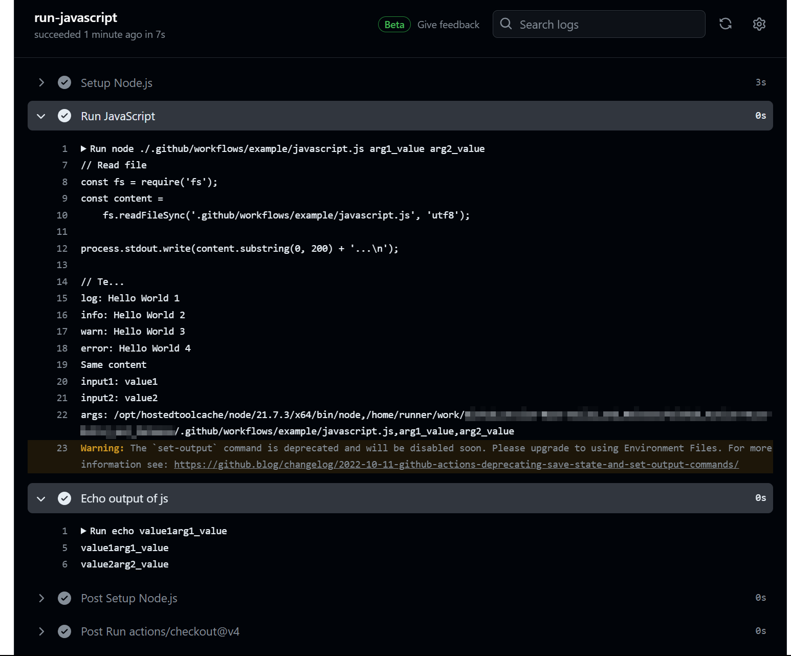

### 更好的执行 js 脚本

我们可以用外部库 [actions/github-script(外部链接)](https://github.com/actions/github-script)

它有一些更高级的功能.

#### 库内读写权限

不过在使用一些功能前, 我们需要更改GitHub actions 的权限, 从只读变为可写
如下所示
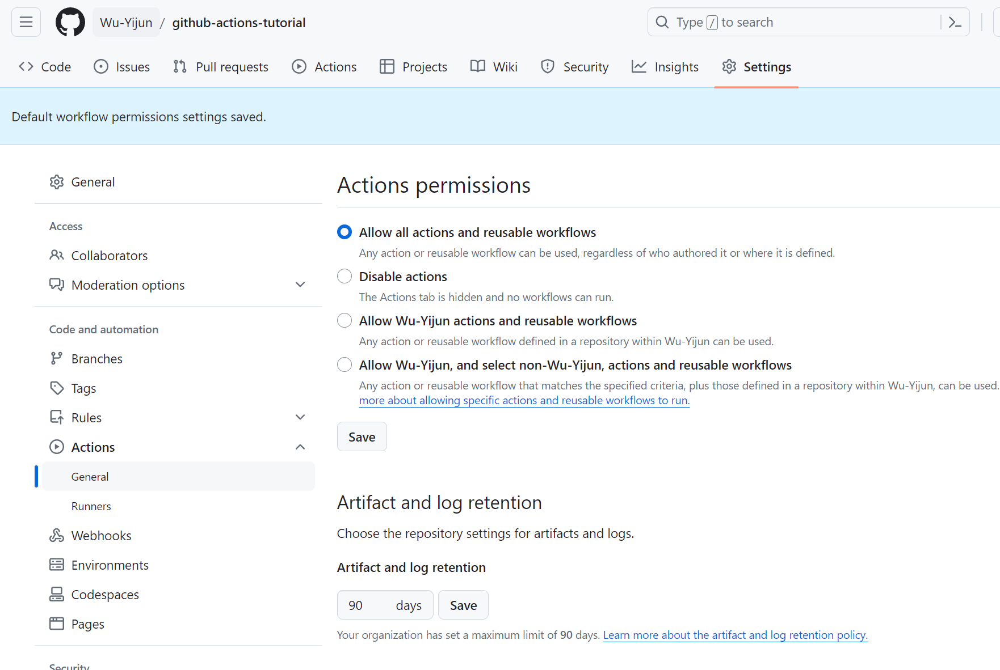
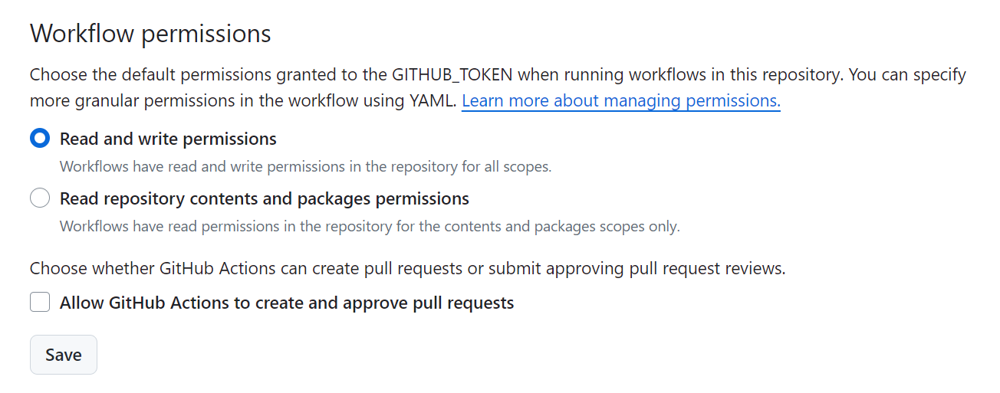

#### 概述

这个库有优点也有缺点, 优点就是它先天的提供了一些可用函数, 方法, 变量, 不需要我们手动加载一些库或环境, 并将很多常用操作封装好了, 我们可用快捷地一键套用. 
而缺点则是它是直接从 yaml 加载的脚本, 不能从文件加载(不过可在 script 中 require 其它 js ), 编辑时没有语法高亮, 最后, 报错信息比较模糊, 不利于 debug.

#### 输入输出

有多种形式提供输入, 一种是设置环境变量, 使用 `process.env.NAME` 调用, 一种是使用 `${{ steps.step-id.outputs.NAME }}` 作为文本直接嵌入, 最后是设置在 input 里使用 `core.getInput(NAME)` 获取 yaml 的 input 的输入

输出也有许多形式, 最简单的是 return 返回一个值. 我们可以设置 result-encoding 为 string 或 json, 然后通过 `${{ steps.step-id.outputs.result }}` 来访问返回的结果; 如果我们设置为 json, 这个 json 对象不可以通过 `${{ steps.step-id.outputs.result.key }}` 来访问 key 对应的 value, 还是只能用 `${{ steps.step-id.outputs.result }}` 获取整个 json  .
此外, `core.exportVariable('NAME', value)` 可以将值写入环境变量, 后续可用从环境变量中直接获取此结果.

示例如下:
```yaml
# input and output
- name: set input
  id: set-input
  run: |
    echo 'hello=Hello' > $GITHUB_ENV
    echo 'world=World' > $GITHUB_OUTPUT
- name: get and set env
  id: get-and-set-env
  uses: actions/github-script\@main
  env:
    COMMA: ', '
  with:
    script: |
      const hello = process.env.hello
      const world = "${{ steps.set-input.outputs.world }}"
      const comma = process.env.COMMA
      console.log(hello, comma, world, '!')
      core.exportVariable('WORLD', hello + comma + world + '!')
      return { greeting: hello + comma + 'world!', array: [1, 2, 3]}
    result-encoding: json
- name: print output
  run: |
    echo $WORLD
    echo "${{ steps.get-and-set-env.outputs.result.greeting }}"
    echo "${{ steps.get-and-set-env.outputs.result }}"
```

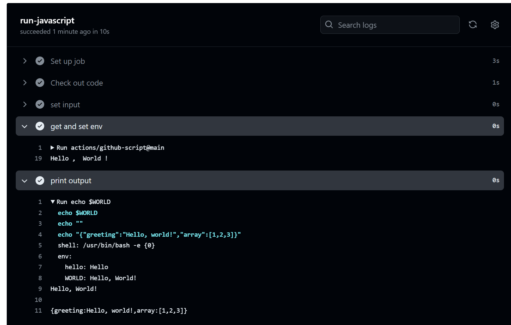

#### 从文件运行 js

前文提到, 在 yaml 中编辑 js 很容易出错, 因此我们可以在其它文件中写好, 然后在yaml中引入的方式运行.
而这个库 `actions/github-script` 不能直接运行文件, 因此需要我们手动导入. 方法有三种.

最简单的就是构造一个函数, 然后运行它, 格式为 `Function('param-Name-1', 'param-Name-2', ..., 'scripts')(p1, p2, ...)`, 其中 Function 通过 script 文本构造一个函数, 该函数的输入参数列表直接写在前面, 然后我们在Function后面输入参数调用这个函数, 实现运行的效果.

更好更安全的方法是利用 `require('path/to/script.js')(params, ...)` , 而在外部文件中使用 `module.exports = (params, ...)=>{scripts}` 的方式导出这个函数供我们 require 使用.

如果导出的是 async 函数, 我们使用 `await require('$$path/to/script.js')(params, ...)` 的方式直接运行即可. (在外部文件中使用 `module.exports = async (params, ...)=>{scripts}` 的方式导出异步函数)

代码片段如下:
```javascript
const fs = require('fs')
const script = fs.readFileSync('.github/workflows/example/hello-world.js')
const text = "Eval script"
Function('text', script)(text);

const script_sync = require('.github/workflows/example/hello-world-sync.js')
script_sync(github, context, core, "Synchronous function")

const script_async = require('.github/workflows/example/hello-world-async.js')
await script_async(github, context, core, "Asynchronous function")
```

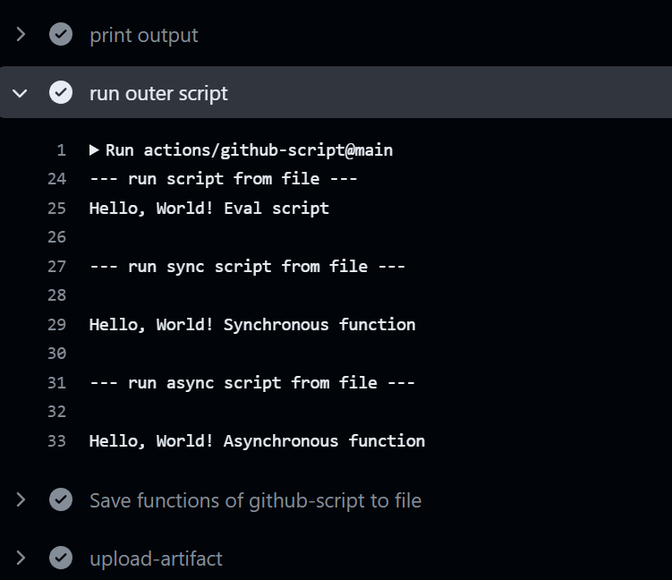

#### 观察上下文中有哪些变量

主要就是方便我们观察和使用, 把所有的变量打印出来保存到文件里

使用 util.inspect 以获取当前变量的详细内容(类似于 console.log 的结果), 然后保存到workflow的附件中.


```yaml
# save context to file
- name: Save functions of github-script to file
  uses: actions/github-script\@main
  with:
    script: |
      const fs = require('fs')
      const util = require('util');
      fs.writeFileSync('github-script-context.txt', 'this = ' + util.inspect(this) + '\n\n')
      fs.appendFileSync('github-script-context.txt', 'github = ' + util.inspect(github) + '\n\n')
      fs.appendFileSync('github-script-context.txt', 'context = ' + util.inspect(context) + '\n\n')
      fs.appendFileSync('github-script-context.txt', 'core = ' + util.inspect(core) + '\n\n')
      fs.appendFileSync('github-script-context.txt', 'glob = ' + util.inspect(glob) + '\n\n')
      fs.appendFileSync('github-script-context.txt', 'io = ' + util.inspect(io) + '\n\n')
      fs.appendFileSync('github-script-context.txt', 'exec = ' + util.inspect(exec) + '\n\n')
      fs.appendFileSync('github-script-context.txt', 'require = ' + util.inspect(require) + '\n\n')
      process.env['INPUT_GITHUB-TOKEN'] = '***'
      process.env['ACTIONS_RUNTIME_TOKEN'] = '***'
      fs.appendFileSync('github-script-context.txt', 'process = ' + util.inspect(process) + '\n\n')
      fs.appendFileSync('github-script-context.txt', 'global = ' + util.inspect(global) + '\n\n')
- name: upload-artifact
  uses: actions/upload-artifact\@main
  with:
    name: github-script-context
    path: github-script-context.txt
```

结果:
*github-script-context.txt*
```js
this = <ref *1> Object [global] {
  global: [Circular *1],
  clearImmediate: [Function: clearImmediate],
  setImmediate: [Function: setImmediate] {
    [Symbol(nodejs.util.promisify.custom)]: [Getter]
  },
  clearInterval: [Function: clearInterval],
  clearTimeout: [Function: clearTimeout],
  setInterval: [Function: setInterval],
  setTimeout: [Function: setTimeout] {
    [Symbol(nodejs.util.promisify.custom)]: [Getter]
  },
  queueMicrotask: [Function: queueMicrotask],
  structuredClone: [Function: structuredClone],
  atob: [Getter/Setter],
  btoa: [Getter/Setter],
  performance: [Getter/Setter],
  fetch: [AsyncFunction: fetch],
  crypto: [Getter]
}

github = <ref *1> NewOctokit {
  request: [Function: newApi] {
    endpoint: [Function: bound endpointWithDefaults] {
      DEFAULTS: [Object],
      defaults: [Function: bound withDefaults],
      merge: [Function: bound merge],
      parse: [Function: parse]
    },
    defaults: [Function: bound withDefaults]
  },
  graphql: [Function: newApi] {
    defaults: [Function: bound withDefaults],
    endpoint: [Function: bound endpointWithDefaults] {
      DEFAULTS: [Object],
      defaults: [Function: bound withDefaults],
      merge: [Function: bound merge],
      parse: [Function: parse]
    }
  },
  log: {
    debug: [Function: debug],
    info: [Function: info],
    warn: [Function: bound warn],
    error: [Function: bound error]
  },
  hook: [Function: bound register] {
    api: {
      remove: [Function: bound removeHook],
      before: [Function: bound addHook],
      error: [Function: bound addHook],
      after: [Function: bound addHook],
      wrap: [Function: bound addHook]
    },
    remove: [Function: bound removeHook],
    before: [Function: bound addHook],
    error: [Function: bound addHook],
    after: [Function: bound addHook],
    wrap: [Function: bound addHook]
  },
  auth: [Function: bound auth] AsyncFunction {
    hook: [Function: bound hook] AsyncFunction
  },
  rest: {
    actions: { octokit: [Circular *1], scope: 'actions', cache: {} },
    activity: { octokit: [Circular *1], scope: 'activity', cache: {} },
    apps: { octokit: [Circular *1], scope: 'apps', cache: {} },
    billing: { octokit: [Circular *1], scope: 'billing', cache: {} },

......
```

#### js 中使用 REST API

Octokit 和 REST Api 才是这个库的**核心**所在.

通常情况下, 我们使用 Octokit 是需要先获取授权的 *(Oauth)* , 而这个授权需要使用 token, 很容易出现奇奇怪怪的问题导致授权失败.
而这个库给出的变量 `github` 是已经预先完成授权的 Octokit, 因此我们可以直接调用 `github.request()` 来访问 Github Api.
比如这个示例我们先获取最新的 release, 得到它的 id. 然后再更新这个 release 的正文, 为 Hello World + 运行次数.
``` javascript
const response = await github.request('GET /repos/{owner}/{repo}/releases/latest', {
  owner: context.repo.owner,
  repo: context.repo.repo,
})
const release = response.data
const result = await github.request('PATCH /repos/{owner}/{repo}/releases/{release_id}', {
  owner: context.repo.owner,
  repo: context.repo.repo,
  release_id: release.id,
  tag_name: 'v0.0.0.1',
  name: 'Hello World Release',
  body: 'Hello World ' + context.runNumber,
})
```

此外, github 还封装了不少可以直接用的操作在 `github.rest` 内, 比如 `github.rest.issues.get`, `github.repos.uploadReleaseAsset` 等等(全部列表可参见 [octokit/rest.js(外部链接)](https://octokit.github.io/rest.js)), 可以简化调用:
```js
github.rest.repos.uploadReleaseAsset({
  owner: context.repo.owner,
  repo: context.repo.repo,
  release_id: process.env.RELEASE,
  name: 'github-script-context-' + context.runNumber + '.txt',
  data: fs.readFileSync('github-script-context.txt'),
})
```

**注意:** `github.rest.name.fun({})` 的返回结果是 `Promise(<response>)` , 如果需要获取返回结果请多加一个 await.

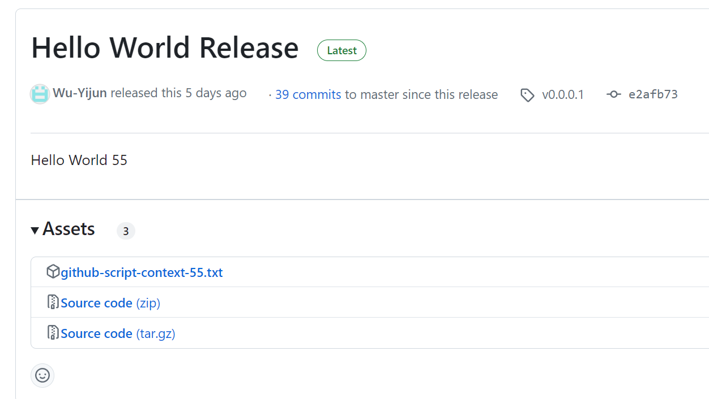

更多关于 [Github REST 的用法](#github-rest-api-教程) 见正文独立章节

#### 全部源码

*.github/workflows/example-javascript-advanced.yaml*
```YAML
name: Example - Run Javascript Advanced

on:
  push:
  workflow_dispatch:

jobs:
  run-javascript:
    runs-on: ubuntu-latest
    # runs-on: self-hosted
    steps:
      - name: Check out code
        uses: actions/checkout\@main
          
      # input and output
      - name: set input
        id: set-input
        run: |
          echo 'hello=Hello' > $GITHUB_ENV
          echo 'world=World' > $GITHUB_OUTPUT
      - name: get and set env
        id: get-and-set-env
        uses: actions/github-script\@main
        env:
          COMMA: ', '
        with:
          script: |
            const hello = process.env.hello
            const world = "${{ steps.set-input.outputs.world }}"
            const comma = process.env.COMMA
            console.log(hello, comma, world, '!')
            core.exportVariable('WORLD', hello + comma + world + '!')
            return { greeting: hello + comma + 'world!', array: [1, 2, 3]}
          result-encoding: json
      - name: print output
        run: |
          echo $WORLD
          echo "${{ steps.get-and-set-env.outputs.result.greeting }}"
          echo "${{ steps.get-and-set-env.outputs.result }}"
        
      # run script from file
      - name: run outer script
        uses: actions/github-script\@main
        with:
          script: |
            console.log('--- run script from file ---');
            const fs = require('fs')
            const script = fs.readFileSync('.github/workflows/example/hello-world.js')
            const text = "Eval script"
            Function('text', script)(text);
            console.log('\n--- run sync script from file ---\n');
            const script_sync = require('.github/workflows/example/hello-world-sync.js')
            script_sync(github, context, core, "Synchronous function")
            console.log('\n--- run async script from file ---\n');
            const script_async = require('.github/workflows/example/hello-world-async.js')
            await script_async(github, context, core, "Asynchronous function")
      
      # save context to file
      - name: Save functions of github-script to file
        uses: actions/github-script\@main
        with:
          script: |
            const fs = require('fs')
            const util = require('util');
            fs.writeFileSync('github-script-context.txt', 'this = ' + util.inspect(this) + '\n\n')
            fs.appendFileSync('github-script-context.txt', 'github = ' + util.inspect(github) + '\n\n')
            fs.appendFileSync('github-script-context.txt', 'context = ' + util.inspect(context) + '\n\n')
            fs.appendFileSync('github-script-context.txt', 'core = ' + util.inspect(core) + '\n\n')
            fs.appendFileSync('github-script-context.txt', 'glob = ' + util.inspect(glob) + '\n\n')
            fs.appendFileSync('github-script-context.txt', 'io = ' + util.inspect(io) + '\n\n')
            fs.appendFileSync('github-script-context.txt', 'exec = ' + util.inspect(exec) + '\n\n')
            fs.appendFileSync('github-script-context.txt', 'require = ' + util.inspect(require) + '\n\n')
            process.env['INPUT_GITHUB-TOKEN'] = '***'
            process.env['ACTIONS_RUNTIME_TOKEN'] = '***'
            fs.appendFileSync('github-script-context.txt', 'process = ' + util.inspect(process) + '\n\n')
            fs.appendFileSync('github-script-context.txt', 'global = ' + util.inspect(global) + '\n\n')
      - name: upload-artifact
        uses: actions/upload-artifact\@main
        with:
          name: github-script-context
          path: github-script-context.txt

      # use REST Api to set latest release to hello world + runNumber
      - name: Use REST Api to set latest release to hello world
        uses: actions/github-script\@main
        with:
          script: |
            const response = await github.request('GET /repos/{owner}/{repo}/releases/latest', {
              owner: context.repo.owner,
              repo: context.repo.repo,
            })
            console.log(response.data)
            const release = response.data
            const result = await github.request('PATCH /repos/{owner}/{repo}/releases/{release_id}', {
              owner: context.repo.owner,
              repo: context.repo.repo,
              release_id: release.id,
              tag_name: 'v0.0.0.1',
              name: 'Hello World Release',
              body: 'Hello World ' + context.runNumber,
            })
            console.log(result.data)
            core.exportVariable('RELEASE', release.id)
      - name: Use REST Api to upload assets to release
        uses: actions/github-script\@main
        with:
          script: |
            // listReleaseAssets
            const ids = await github.rest.repos.listReleaseAssets({
              owner: context.repo.owner,
              repo: context.repo.repo,
              release_id: process.env.RELEASE,
            });
            // deleteReleaseAsset
            for (const id of ids.data) {
              github.rest.repos.deleteReleaseAsset({
                owner: context.repo.owner,
                repo: context.repo.repo,
                asset_id: id.id,
              });
            }
            // uploadReleaseAsset
            const fs = require('fs')
            github.rest.repos.uploadReleaseAsset({
              owner: context.repo.owner,
              repo: context.repo.repo,
              release_id: process.env.RELEASE,
              name: `github-script-context-${context.runNumber}.txt`,
              data: fs.readFileSync('github-script-context.txt'),
            })

```

*.github/workflows/example/hello-world.js*
```js
console.log('Hello, World!', text)
```

*.github/workflows/example/hello-world-sync.js*
```js
module.exports = (github, context, core, text) => {
  console.log('Hello, World!', text)
}
```

*.github/workflows/example/hello-world-async.js*
```js
module.exports = async (github, context, core, text) => {
  // wait for 1 second
  await new Promise(resolve => setTimeout(resolve, 1000))
      .then(() => {console.log('Hello, World!', text)})
}
```

## 运行 Python 脚本

就我个人而言是很不喜欢 python 的, 但是考虑到很多人都沉溺于 Python 无法自拔, 搞个神经网路非得用 python, 我只好*勉为其难*地将最基础的 python 使用写成一节. 更多用法, 像什么 pytorch 的配置, anaconda 的使用, 我绝对不会花时间写的.
*其实我原先是打算先空着不写的, 前两天正好看到有人白嫖 GitHub Actions 来训练神经网路(一次训练要好几天), 我觉得很有意思, 才临时决定加入一个基本的 python 教程的*

**我们用简单的 `numpy` 为例.**

首先, 安装 Python, 需要指定版本号. ` with: python-version: '3.12'` , 这其中有一个选项是缓存, 我们将其设置为 pip, 这样每一次运行 `pip install` 可以从缓存总加载已经安装好的库, 而不必重新安装, 节约时间
接着, 我们安装依赖, 我这里示范了从 requirements.txt 中安装的方法, 如果不用 requirements.txt 可以直接 `- run: pip install numpy` 安装库.
最后, 我们直接运行 python 脚本即可.

源码如下:

*.github/workflows/example/example-python.yaml*
```yaml
name: Example - Run Python

on:
  push:
  workflow_dispatch:

jobs:
  run-python:
    runs-on: ubuntu-latest
    steps:
      - name: Check out code
        uses: actions/checkout\@main
      - name: Setup Python
        uses: actions/setup-python\@main
        with:
          python-version: '3.12'
          cache: 'pip'
      - name: Install dependencies
        run: pip install -r .github/workflows/example/python/requirements.txt
      - name: Run Python script
        run: python .github/workflows/example/python/hello-world.py
```

*.github/workflows/example/python/requirements.txt*
``` py
# sample requirements.txt
numpy
```

*.github/workflows/example/python/hello-world.py*
```py
import numpy as np

print("Hello, world!")

a = np.array([1, 2, 3])
print(a)
```

**运行结果:**
可以看到, 在运行期间使用了缓存, 加速了 python 环境的安装.
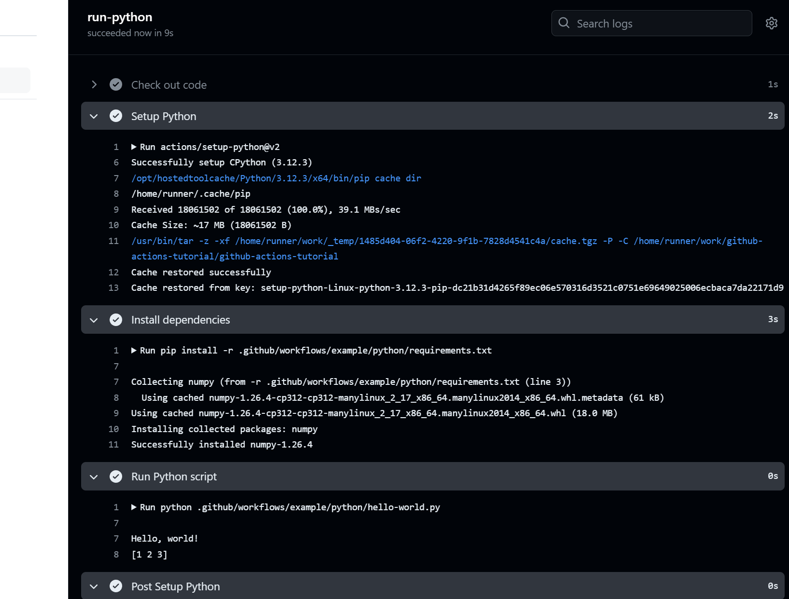

在 Actions 的缓存区也可以看到创建了一个缓存, 创建于 12 分钟前, 而在 2 分钟前被使用了.
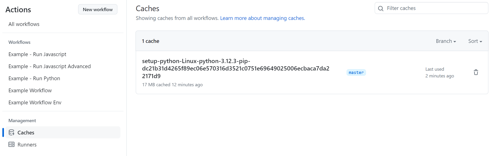

而首次运行的记录如下, 它没有检测到缓存, 于是在安装依赖项时下载了 `numpy` 库, 在运行结束时 `Post Setup Python` 将缓存保存了.
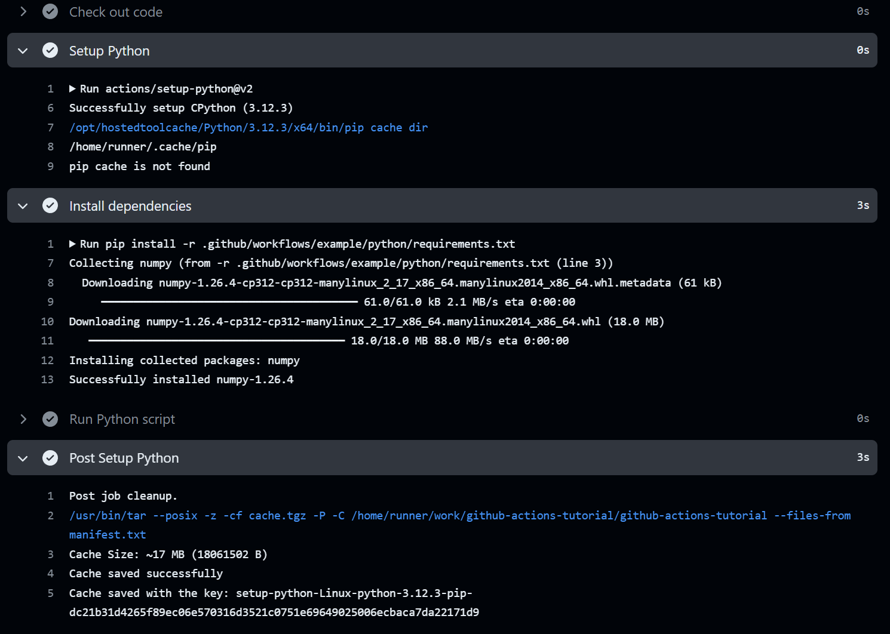

**Python 我就写这么多**, 更多信息可以到外部库的GitHub页面寻找 [actions/python(外部链接)](https://github.com/actions/setup-python) , 里面还有一些[高级用法(外部链接)](https://github.com/actions/setup-python?tab=readme-ov-file#advanced-usage)

至于 Pytorch 如何安装, 等等的一系列问题, 我就不写了, 谁想写谁写(我可以帮你加到目录里), ~~Python 狗都不用(大雾)~~

## 上传和下载附件

**同样也用于在工作间传递文件.**

这是个很轻松的话题, 毕竟只是简单介绍一下三个库的使用.

### Actions 库

最经典的就是上传和下载 Actions 库.

上传文件


## Github REST Api 教程

